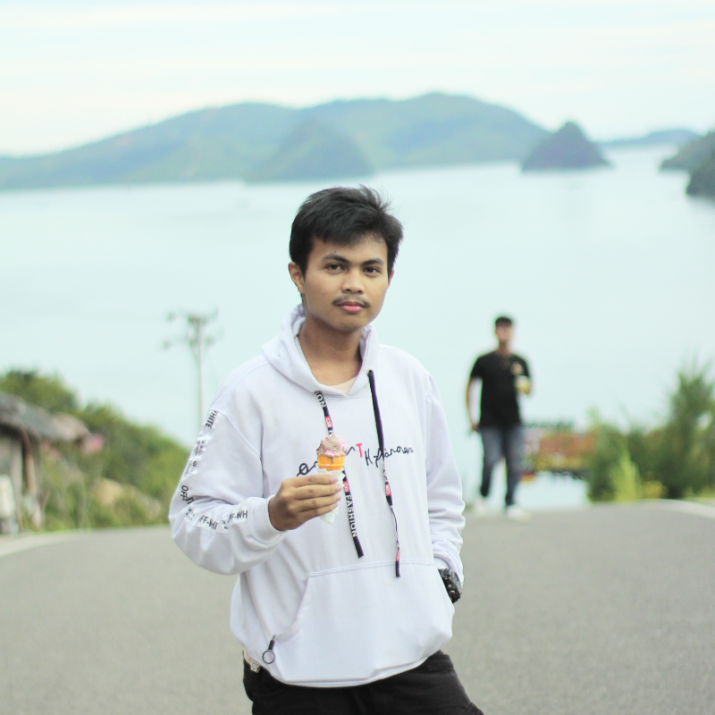

# 💼 Personal Portfolio & Content Management System (CMS)

<p align="center">
  
</p>

<p align="center">
  <strong>Ahmad Zaki — Web Developer | PHP, Laravel & Backend Specialist</strong><br>
  A modern, responsive, and robust personal portfolio website integrated with a powerful Admin CMS dashboard built using Laravel 11.
</p>

<p align="center">
  <a href="https://portofolioahmadzaki.my.id/" target="_blank">
    
  </a>
  
  
  
  
  
</p>

---

## 🌟 Ringkasan Proyek (Overview)

Aplikasi web ini merupakan platform portofolio digital profesional yang dirancang khusus untuk menampilkan profil keahlian teknis, riwayat pengalaman kerja, proyek-proyek unggulan, sertifikasi, layanan, dan ulasan klien. 

Seluruh konten yang tampil pada halaman depan (*Frontend*) terhubung secara dinamis dengan **Panel Administrasi (*Admin CMS*)** yang aman, memungkinkan pengelolaan portofolio, pesan masuk dari calon klien, hingga kustomisasi tema visual website secara langsung tanpa perlu mengubah baris kode.

Website ini sudah dioptimalkan untuk performa tinggi, keamanan ketat, dan kompatibilitas penuh dengan server hosting **cPanel (Shared Hosting seperti Rumahweb)** melalui arsitektur penyimpanan berkas otomatis (*Storage Streamer Route*) tanpa ketergantungan pada *symbolic link* sistem operasi.

---

## 🌐 Tautan Resmi (Live Deployment)

* **Website Portofolio:** [https://portofolioahmadzaki.my.id/](https://portofolioahmadzaki.my.id/)
* **Panel Administrasi:** [https://portofolioahmadzaki.my.id/admin](https://portofolioahmadzaki.my.id/admin)
* **Unduh CV Resmi:** [https://portofolioahmadzaki.my.id/download-cv](https://portofolioahmadzaki.my.id/download-cv)
* **RESTful API v1 Index:** [https://portofolioahmadzaki.my.id/api/v1](https://portofolioahmadzaki.my.id/api/v1)

---

## ✨ Fitur Utama (Key Features)

### 🖥️ 1. Halaman Depan (Frontend Pengunjung)
- **Hero Section Interaktif:**
  - Animasi teks mengetik (*Typewriter*) pada spesialisasi profesi.
  - Kartu counter statistik dinamis (Jumlah proyek selesai, tahun pengalaman, klien puas, dan REST API) dengan animasi penghitung angka otomatis.
  - **Tombol Unduh CV Otomatis (`/download-cv`):** Terhubung ke *streamer* dokumen PDF resmi yang langsung memicu unduhan file `CV_Ahmad_Zaki.pdf` di peramban desktop maupun ponsel cerdas.
  - Tautan media sosial dinamis yang terhubung ke database `social_links`.
- **Tentang Saya (About):**
  - Biografi lengkap, tujuan karir, data kontak, dan kartu riwayat pendidikan terakhir yang sinkron dengan database.
- **Keahlian Teknis (Skills & Tech Stack):**
  - Pengelompokan kategori dinamis (Backend, Database, Frontend, Mobile, Tools, dll.).
  - Indikator baris progres penguasaan keahlian (*animated progress bars*).
- **Portofolio Proyek Unggulan (Projects):**
  - Kartu proyek dengan thumbnail rasio 16:10 / 16:9, deskripsi, tag teknologi, tautan GitHub, dan tombol *Live Demo*.
  - Label ⭐ **Unggulan** (*Featured Badge*) untuk proyek pilihan.
  - *Storage Fallback System* cerdas yang memastikan foto proyek selalu tampil di server daring.
- **Riwayat Pengalaman Kerja (Experience):**
  - Garis waktu (*timeline*) pekerjaan dan magang profesional dengan rincian peran, instansi, tanggal kerja, dan deskripsi tugas.
- **Riwayat Pendidikan (Education):**
  - Mendukung jenjang Kuliah (IPK & Gelar) maupun SMA/SMK (Nilai akhir/Akreditasi).
- **Sertifikasi & Lisensi (Certificates):**
  - Galeri sertifikat pelatihan dengan pratinjau dokumen, tombol buka file PDF, dan tautan verifikasi kredensial (*credential URL*).
  - **Lightbox Modal Popup:** Pratinjau sertifikat resolusi penuh tanpa terpotong dengan efek animasi halus dan *backdrop blur*.
- **Layanan & Solusi (Services):**
  - Kartu penawaran jasa pengembangan web modern, arsitektur RESTful API, dan optimasi basis data MySQL.
- **Penilaian & Testimoni Klien (Reviews):**
  - Tampilan rating bintang (1-5) dari klien yang terverifikasi.
  - Formulir popup interaktif bagi klien/pengunjung untuk memberikan testimoni baru secara instan melalui AJAX (masuk ke antrean moderasi admin).
- **Formulir Kontak & Peta Interaktif (Contact & Google Maps):**
  - Formulir pengiriman pesan AJAX dengan validasi data *real-time* dan popup modal konfirmasi pengiriman.
  - Proteksi anti-spam via *rate limiting* (`throttle:5,1`).
  - Peta Google Maps interaktif yang otomatis menyesuaikan alamat profil admin.
- **Footer Dinamis:**
  - Teks hak cipta tahun otomatis terbarui dan tautan akses admin terproteksi.

---

### 🛡️ 2. Panel Admin (Admin Dashboard & CMS)
- **Dashboard Ringkasan Eksekutif:**
  - Kartu statistik jumlah data secara *real-time* (Projects, Skills, Experience, Education, Certificates, Services, Statistics, Social Links, Reviews, Messages).
  - Banner peringatan pesan belum dibaca (*Unread messages banner*).
  - Tabel 5 pesan terbaru dari formulir kontak masuk.
- **Manajemen Pesan Masuk (Contact Messages):**
  - Kotak masuk lengkap dengan pencarian nama, email, nomor HP, subjek, maupun isi pesan.
  - Filter pesan: *Semua*, *Belum Dibaca*, dan *Sudah Dibaca*.
  - Aksi sekali klik: Buka detail pesan, tandai sudah/belum dibaca, tandai semua dibaca, atau hapus pesan.
  - Tombol pintas untuk membalas langsung via **WhatsApp** atau **Email**.
  - Pengecekan status notifikasi pesan baru secara berkala (*real-time polling*).
- **Pengaturan Website (Website Settings):**
  - Ubah Nama Website / Judul Tab peramban.
  - Unggah Logo kustom untuk navbar frontend (dengan opsi kembali ke lencana inisial `AZ`).
  - **Dual Favicon System (Icon Tab Terpisah):**
    - Unggah **Icon Tab Frontend** (Favicon khusus pengunjung website).
    - Unggah **Icon Tab Admin** (Favicon khusus panel dashboard admin & portal login).
    - Dilengkapi file fallback bawaan: `site-favicon.svg` dan `admin-favicon.svg`.
  - **Sinkronisasi Storage Mandiri:** Banner status storage cerdas dan tombol sinkronisasi storage yang ramah shared hosting (bebas error fungsi `exec()`).
  - **Color Palette Switcher:** Pilih warna primer dan sekunder dengan *color picker* visual atau tombol preset tema (*Modern Blue*, *Emerald Green*, *Indigo Tech*, *Royal Purple*, *Crimson Rose*) dengan pratinjau tombol langsung.
  - Kustomisasi teks hak cipta (*footer copyright*).
- **Kelola Profil Portofolio:**
  - Perbarui foto profil, nama lengkap, profesi, deskripsi singkat, biografi, tujuan karir, dan kontak.
  - Konfigurasi alamat dan embed Google Maps dengan *live preview frame*.
  - Unggah berkas Curriculum Vitae (CV) format PDF dengan tautan uji unduh langsung di form admin.
- **Modul CRUD Data Portofolio Lengkap:**
  - CRUD Kategori & Nama Skill.
  - CRUD Proyek (Thumbnail, Judul, Slug unik, Status Draft/Published, Checkbox Unggulan).
  - CRUD Pengalaman Kerja.
  - CRUD Riwayat Pendidikan.
  - CRUD Sertifikat & Lisensi (Gambar & Berkas PDF).
  - CRUD Layanan Jasa.
  - CRUD Kartu Statistik Hero.
  - CRUD Media Sosial.
  - Moderasi Penilaian Klien (Menyetujui ulasan agar tampil di web atau menghapusnya).
- **Modal Konfirmasi Hapus Interaktif:**
  - Menggantikan dialog pop-up bawaan browser yang kaku dengan modal kustom modern (animasi *scale-in*, *backdrop blur*, dan badge nama target item yang akan dihapus).
  - Proteksi aksi berbahaya: Indikator peringatan risiko permanen, penutupan instan via tombol keyboard `Esc` atau klik backdrop, serta tombol konfirmasi dengan indikator animasi *loading spinner*.

---

### 🚀 3. Arsitektur Kompatibilitas Hosting (cPanel / Rumahweb Ready)
- **Rute Penyajian Storage Publik (`/storage/{path}`):**
  Mengatasi kendala umum shared hosting cPanel di Indonesia (seperti Rumahweb) yang menonaktifkan fungsi PHP `exec()` dan `symlink()`. Seluruh berkas unggahan publik (foto profil, CV, foto proyek, sertifikat, logo) otomatis disajikan secara langsung dan aman oleh rute internal Laravel dengan *Cache-Control* optimal.
- **Pembersihan Berkas Otomatis:**
  Pengunggahan berkas baru otomatis menghapus berkas lama dari disk penyimpanan untuk mencegah penumpukan berkas sampah (*orphan files*).
- **Bebas Error Parser PHP 7.4 / 8.0:**
  Kodingan telah diaudit bebas dari operator yang tidak dikenali parser cPanel lama, menjamin kehandalan eksekusi pada seluruh versi PHP 8.0 s/d 8.3+.

---

## 🔒 Arsitektur Keamanan (Security Highlights)

Proyek ini telah dikonfigurasi dan diaudit mengikuti standar keamanan web modern:

1. **Isolasi Sesi & Cookie Pengguna:**
   - Sesi login terisolasi sepenuhnya di peramban masing-masing pengguna.
   - Sesi dienkripsi menggunakan algoritma **AES-256-CBC** dengan `APP_KEY` server.
   - Cookie sesi dilengkapi flag `HttpOnly = true` (melindungi dari serangan XSS) dan `SameSite = lax` (mencegah CSRF lintas domain).
2. **Proteksi Middleware Otentikasi (`auth`):**
   - Seluruh rute `/admin/*` diapit oleh middleware otentikasi. Permintaan tanpa sesi login langsung dialihkan (*302 Redirect*) ke halaman login.
3. **Pencegahan Registrasi Liar:**
   - Rute registrasi publik (`/register`) telah ditutup dan dialihkan ke `/login`, sehingga tidak ada pihak luar yang dapat membuat akun secara sepihak untuk menembus panel admin.
4. **Proteksi Session Fixation:**
   - Sesi di-regenerasi secara otomatis saat pengguna berhasil login (`$request->session()->regenerate()`), dan dihancurkan secara total saat logout (`$request->session()->invalidate()`).
5. **Validasi & Sanitasi Data:**
   - Semua input form di Frontend maupun Admin divalidasi ketat di sisi server (*Server-Side Validation*) untuk menangkal injeksi kode (*SQL Injection & XSS*).
   - Berkas yang diunggah difilter berdasarkan ekstensi yang diizinkan (*mimes*) dan batasan ukuran maksimal (*max filesize*).
6. **Rate Limiting (Anti Spam / Anti Brute Force):**
   - Formulir kontak (`/contact`), ulasan (`/reviews`), dan API kontak dibatasi dengan *throttling* untuk mencegah serangan spam bot otomatis.

---

## 🛠️ Tumpukan Teknologi (Tech Stack)

| Lapisan | Teknologi | Deskripsi |
| :--- | :--- | :--- |
| **Backend Framework** | [Laravel 11.x](https://laravel.com/) | Kerangka kerja PHP modern berarsitektur MVC |
| **Bahasa Pemrograman** | PHP 8.2+ | Bahasa backend utama dengan performa tinggi |
| **Database** | MySQL 8.0 / MariaDB | Basis data relasional dengan skema terstruktur |
| **Frontend Styling** | Vanilla CSS + Tailwind CSS | Desain responsif, clean glassmorphism, dan micro-animations |
| **Icons & Font** | Bootstrap Icons, Devicons, Google Fonts | Inter & Poppins typography, ikon grafis modern |
| **Frontend Logic** | JavaScript (ES6+), Alpine.js | Manipulasi DOM, validasi AJAX, dan penanganan modal |
| **Asset Bundler** | [Vite 5.x](https://vitejs.dev/) | Kompilasi aset CSS dan JavaScript cepat |

---

## 📂 Struktur Direktori Utama

```
d:/AhmadZakiProject/
├── app/
│   ├── Http/
│   │   ├── Controllers/
│   │   │   ├── Admin/              # Controller Panel Admin (Dashboard, Setting, Profile, CRUD, Contact)
│   │   │   ├── Api/V1/             # RESTful API Controller (PortfolioApiController - 14 Endpoints)
│   │   │   ├── Auth/               # Controller Otentikasi Laravel Breeze
│   │   │   └── Frontend/           # Controller Halaman Depan (Home, Contact, Review)
│   │   └── Requests/               # Validasi Request Form
│   ├── Models/                     # Eloquent Models (Project, Skill, Setting, Contact, Profile, Certificate, Review, dll.)
│   └── Providers/                  # Service Providers (AppServiceProvider - View Composers)
├── config/                         # Konfigurasi Aplikasi (filesystems, database, auth, session, dll.)
├── database/
│   ├── migrations/                 # Skema Tabel Basis Data (25 Migrasi Lengkap)
│   └── seeders/                    # Data Awal / Seeder Portofolio
├── public/
│   ├── assets/                     # Berkas Ikon & Aset Statis (site-favicon.svg, admin-favicon.svg, profile.png)
│   ├── build/                      # Hasil Kompilasi Aset Produksi Vite (manifest.json, CSS, JS)
│   ├── css/                        # Berkas style.css kustom & cropper.min.css
│   └── js/                         # Berkas main.js & cropper.min.js
├── resources/
│   ├── css/                        # Tailwind Source CSS
│   ├── js/                         # Application JavaScript & Typewriter Script
│   └── views/
│       ├── admin/                  # Tampilan Admin Panel (Dashboard, Settings, Profile, Contacts, CRUD)
│       ├── auth/                   # Tampilan Login & Reset Password
│       ├── components/             # Komponen Blade (admin-layout, modal, image-cropper)
│       ├── frontend/               # Parsial Halaman Depan (hero, about, skill, project, certificate, review, dll.)
│       └── layouts/                # Template Induk (frontend & guest layouts)
├── routes/
│   ├── api.php                     # Rute RESTful API v1 (/api/v1/*) - 14 Endpoint
│   ├── auth.php                    # Rute Autentikasi Pengguna
│   └── web.php                     # Rute Frontend, Rute Storage Streamer, & Rute Admin Terproteksi
└── storage/                        # Penyimpanan Berkas Upload Publik (Logo, Foto, Sertifikat, CV)
```

---

## 🌐 Dokumentasi RESTful API (Versi 1)

Proyek ini telah dilengkapi antarmuka **14 Endpoint RESTful API v1** yang siap diintegrasikan dengan aplikasi Mobile (Flutter, React Native, Android/iOS) maupun Frontend modern terpisah (Next.js, Nuxt, Vue, React).

- **Base URL:** `https://portofolioahmadzaki.my.id/api/v1`
- **Format Respons:** JSON Envelope Standar (`success`, `message`, `data`)
- **Proteksi:** Rate Limiting (60 req/menit untuk data publik, 5 req/menit untuk kontak)

### Format Respons Standar:
```json
{
  "success": true,
  "message": "Data proyek berhasil diambil.",
  "data": [ ... ]
}
```

### Daftar 14 Endpoint API:

| No | Method | Endpoint | Deskripsi Data |
|:---:|:---:|:---|:---|
| **1** | `GET` | `/api/v1` | **API Directory / Index** (Informasi versi API, status operasional, & direktori rute) |
| **2** | `GET` | `/api/v1/profile` | Data profil pribadi pengembang, biodata, kontak, dan tautan unduh CV |
| **3** | `GET` | `/api/v1/projects` | Daftar seluruh proyek portofolio berstatus *Published* |
| **4** | `GET` | `/api/v1/projects/{slug}` | Detail lengkap satu proyek berdasarkan *slug* unik |
| **5** | `GET` | `/api/v1/skills` | Daftar keahlian teknis & *tech stack* aktif beserta persentase levelnya |
| **6** | `GET` | `/api/v1/experiences` | Daftar riwayat pengalaman kerja & magang profesional |
| **7** | `GET` | `/api/v1/education` | Daftar riwayat latar belakang pendidikan (Kuliah / SMA/SMK) |
| **8** | `GET` | `/api/v1/certificates` | Daftar sertifikasi kompetensi (termasuk URL berkas gambar & PDF) |
| **9** | `GET` | `/api/v1/services` | Daftar penawaran layanan / jasa pengembangan yang disediakan |
| **10** | `GET` | `/api/v1/statistics` | Data angka metrik *counter* di hero section |
| **11** | `GET` | `/api/v1/reviews` | Daftar ulasan dan testimoni klien yang telah disetujui (*Approved*) |
| **12** | `GET` | `/api/v1/social-links` | Daftar tautan media sosial aktif |
| **13** | `GET` | `/api/v1/settings` | Pengaturan publik situs (nama website, logo URL, warna tema, favicon) |
| **14** | `POST` | `/api/v1/contacts` | Mengirim pesan kontak masuk dari aplikasi klien (*rate-limited: 5 req/menit*) |

### Contoh Pemanggilan via cURL:

#### 1. Mengambil Daftar Proyek:
```bash
curl -X GET "https://portofolioahmadzaki.my.id/api/v1/projects" \
     -H "Accept: application/json"
```

#### 2. Mengirim Pesan Kontak (POST):
```bash
curl -X POST "https://portofolioahmadzaki.my.id/api/v1/contacts" \
     -H "Content-Type: application/json" \
     -H "Accept: application/json" \
     -d '{
       "name": "Klien Potensial",
       "email": "klien@example.com",
       "phone": "08123456789",
       "subject": "Tawaran Proyek Web Application",
       "message": "Halo Zaki, saya tertarik untuk mendiskusikan pembuatan aplikasi Laravel baru."
     }'
```

---

## 📐 Panduan Dimensi Gambar & Media

Untuk menjaga tampilan portofolio tetap rapi, tajam, dan tidak terpotong:

| Jenis Media | Rasio Tampilan | Resolusi Rekomendasi | Catatan Tampilan |
|:---|:---:|:---:|:---|
| **Thumbnail Proyek** | `16 : 10` / `16 : 9` | **`1200 × 750 px`** *(HD)* | Kotak kartu diatur `object-fit: cover`. Gunakan Image Cropper di admin. |
| **Gambar Sertifikat** | `4 : 3` / `16 : 10` | **`1200 × 850 px`** | Tampil rapi di kartu, dan tampil 100% utuh saat diklik di modal popup. |
| **Foto Profil** | `1 : 1` *(Persegi)* | **`600 × 600 px`** | Tampil melingkar di hero section dan navbar. |
| **Logo Website** | Bebas / Transparan | **`Tinggi 80 - 120 px`** | Format PNG transparan atau SVG. |
| **Icon Tab (Favicon)** | `1 : 1` *(Persegi)* | **`64 × 64 px`** | Format `.svg`, `.ico`, atau `.png` transparan. |
| **Curriculum Vitae (CV)**| Dokumen PDF | Maksimal **8 MB** | Format dokumen PDF resmi. |

---

## 🚀 Panduan Instalasi Lokal (Getting Started)

Ikuti langkah-langkah di bawah ini untuk menjalankan proyek ini di komputer lokal:

### 1. Prasyarat Sistem
- PHP >= 8.2 (dengan ekstensi `pdo_mysql`, `mbstring`, `openssl`, `fileinfo`, `gd`/`imagick`)
- Composer >= 2.x
- Node.js >= 18.x & NPM
- MySQL >= 8.0 atau MariaDB

### 2. Kloning Repository & Masuk ke Direktori
```bash
git clone https://github.com/ahmadzakiproject/ahmadzakiproject.git
cd ahmadzakiproject
```

### 3. Instal Dependensi PHP & Node.js
```bash
composer install
npm install
```

### 4. Konfigurasi Lingkungan (`.env`)
Salin file konfigurasi contoh:
```bash
cp .env.example .env
```
Buka file `.env` lalu sesuaikan konfigurasi basis data Anda:
```env
APP_NAME="Portofolio Ahmad Zaki"
APP_ENV=local
APP_KEY=
APP_DEBUG=true
APP_URL=http://localhost:8000

DB_CONNECTION=mysql
DB_HOST=127.0.0.1
DB_PORT=3306
DB_DATABASE=db_portfolio
DB_USERNAME=root
DB_PASSWORD=
```

### 5. Generate Application Key
```bash
php artisan key:generate
```

### 6. Migrasi & Seeder Database
Jalankan migrasi tabel beserta data awal portofolio:
```bash
php artisan migrate --seed
```

### 7. Buat Tautan Simbolik Penyimpanan (Storage Link)
```bash
php artisan storage:link
```

### 8. Kompilasi Aset Frontend
```bash
npm run build
```

### 9. Jalankan Server Lokal
```bash
php artisan serve
```
Aplikasi sekarang dapat dibuka di peramban Anda melalui alamat: **`http://127.0.0.1:8000`**.

---

## 🔑 Akses Panel Admin

Untuk mengelola konten website:
1. Akses halaman login di: **`http://127.0.0.1:8000/login`** (atau di website daring: `https://portofolioahmadzaki.my.id/login`).
2. Masukkan akun administrator yang telah terdaftar pada database Anda.
3. Setelah login berhasil, Anda akan otomatis diarahkan ke **Dashboard Admin** (`/admin/dashboard`).

---

## 📋 Checklist Deployment cPanel / Produksi

Saat memperbarui atau mempublikasikan website ke cPanel (Rumahweb / Shared Hosting):
- [x] Rute storage internal `/storage/{path}` sudah aktif untuk menangani berkas tanpa symlink.
- [x] Rute unduh CV `/download-cv` sudah aktif dan teruji.
- [x] Seluruh berkas fallback (`site-favicon.svg`, `admin-favicon.svg`, `profile.png`) tersedia di `public/assets/`.
- [ ] Ubah konfigurasi berkas `.env` server cPanel:
  ```env
  APP_ENV=production
  APP_DEBUG=false
  APP_URL=https://portofolioahmadzaki.my.id
  ```
- [ ] Pastikan versi PHP pada cPanel (MultiPHP Manager) disetel ke **PHP 8.2** atau **PHP 8.3**.
- [ ] Lakukan *Hard Refresh* pada peramban (`Ctrl + F5`) untuk membersihkan cache aset lama.

---

## 📄 Lisensi & Hak Cipta

Proyek ini dikembangkan secara profesional untuk portofolio digital **Ahmad Zaki**.  
© 2026 Ahmad Zaki. Seluruh hak cipta dilindungi undang-undang.
